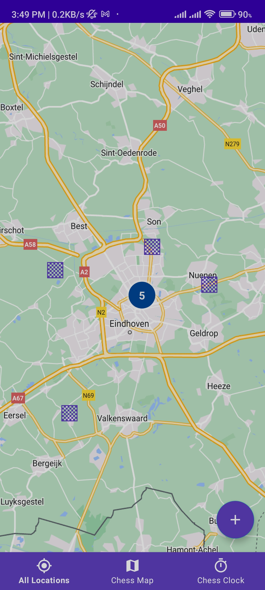
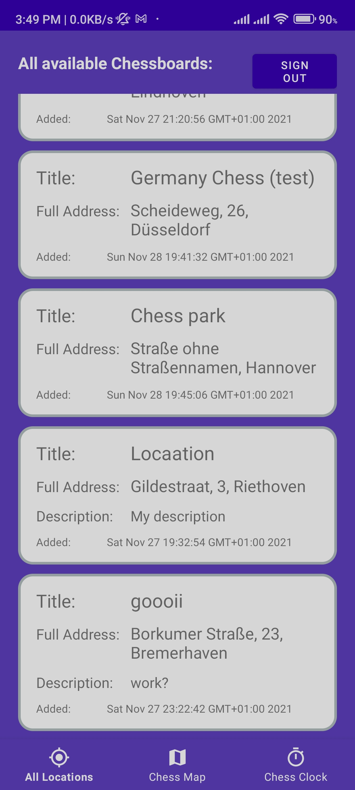
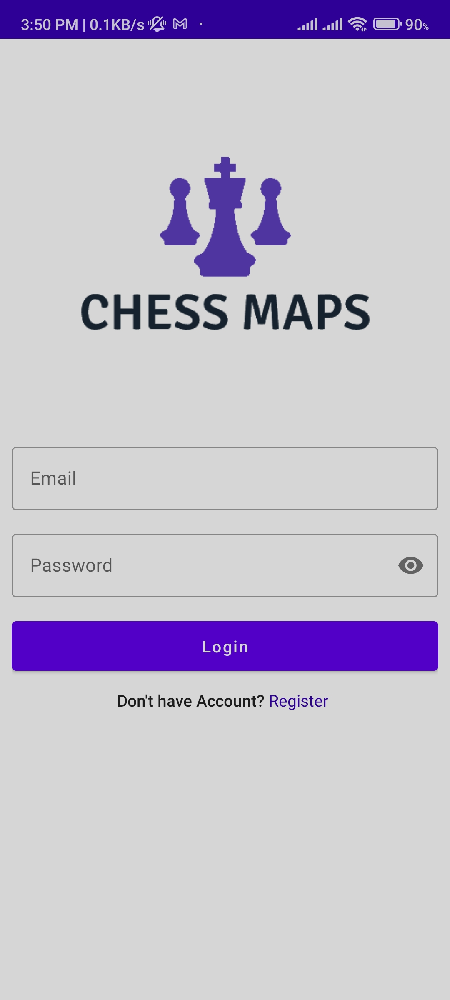
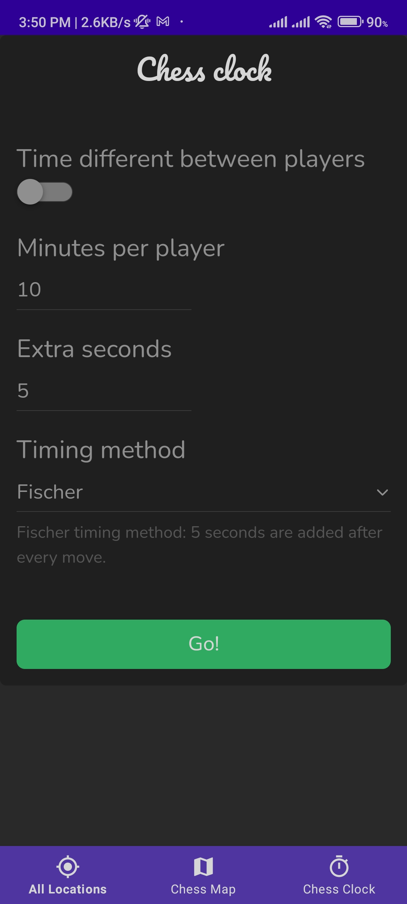

# ChessMaps - Chess Board Finder

A native Android mobile app developed in Kotlin and Android SDK that helps users locate public local chess boards. The app uses the Google Maps API to display the locations of the chess boards. It also includes a chess clock that utilizes a WebView to render a website with chess clock functionality. Firebase was used as the backend to manage location data, and authorized users can add and remove locations.

## Screenshots

  
  
  
  

## Installation

To install and run the app, follow these steps:

1. Clone the repository to your local machine

<pre>

bash<button class="flex ml-auto gap-2"><svg stroke="currentColor" fill="none" stroke-width="2" viewBox="0 0 24 24" stroke-linecap="round" stroke-linejoin="round" class="h-4 w-4" height="1em" width="1em" xmlns="http://www.w3.org/2000/svg"><path d="M16 4h2a2 2 0 0 1 2 2v14a2 2 0 0 1-2 2H6a2 2 0 0 1-2-2V6a2 2 0 0 1 2-2h2"></path><rect x="8" y="2" width="8" height="4" rx="1" ry="1"></rect></svg>Copy code</button>

<code class="!whitespace-pre hljs language-bash">git clone https://github.com/yourusername/public-chess-board-finder.git
</code>

</pre>

2. Open the project in Android Studio
3. Connect your Android device to your computer
4. Click the Run button in Android Studio to install and run the app on your device

## Features

- Locate public local chess boards
- Add and remove locations (for authorized users)
- View locations on Google Maps
- Chess clock functionality

## Technologies

The following technologies were used in the development of this project:

- Kotlin
- Android SDK
- Google Maps API
- Firebase

## Contributors

This project was developed by Vilius Bučinskas If you would like to contribute to the project, please open a pull request on the GitHub repository.
